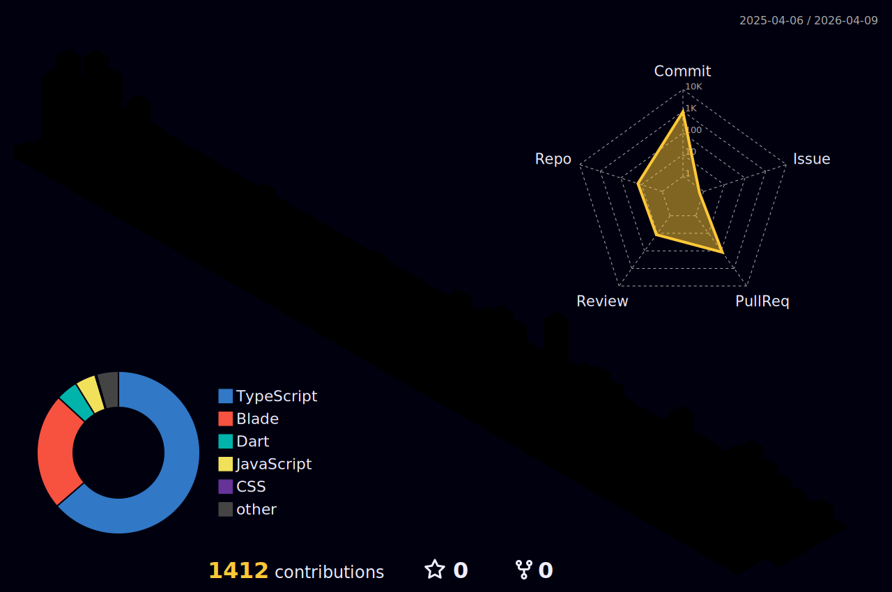

## 🛠️ My Journey

Hello! I'm **Pakkapon Chomchoey**, a third-year **Software Engineering** student at **Burapha University**, SE#13.  
* 🌍  Based in Ang Sila, Chonburi, Thailand  
* ✉️  Contact me at [Pakkapon2547@gmail.com](mailto:Pakkapon2547@gmail.com)  
* 🎓  Faculty of Informatics, BUU  
* 🧠  Currently interested in **Full Stack Development** 

---

### 🏆 Awards & Achievements
- 🥇 **มหาเทพ Full Stack Award** – OSSD#13 Bootcamp (Open Source Software Developers #13 Bootcamp)
- 🎨 **Best UX/UI Design Award** – Cluster 4
---

### 💼 Work Experience

#### Frontend Developer Intern  
**10 BIT DEVELOPMENT CO., LTD.**  
*May 5, 2024 - June 25, 2024*  

- 📝 Designed and developed digital forms for nurses, replacing traditional paper forms with a paperless system.  
- 🎨 Created visually appealing and user-friendly forms using **Vue.js** and **Bootstrap**, closely matching original templates to enhance user experience.  
- 💻 Implemented functionality using **HTML**, **JavaScript**, and **CSS**, ensuring interactivity and usability.
  
**Tech Stack**: `HTML` · `CSS` · `JavaScript` · `Bootstrap CSS` · `Vue.js`

---

### 🔥 Project Highlight

#### Site Selection Analysis System
Developed by **Cluster 4** with **MyOrder Intelligence, LTD.** during the **OSSD#13 Bootcamp**  
*Feb 16, 2025 - Apr 12, 2025* 

A web app for analyzing and managing branch locations using interactive maps and data dashboards.

- 🗺️ Interactive Mapbox-based branch markers (add/edit/delete)
- 🌍 Imported categorized GeoJSON data into SQL database
- 📍 Modal bottom sheet inspired by Google Maps UI
- 🎨 Clean, consistent UI design with color and button standards
- 📊 Sales dashboard with filters, median line charts, and branch order tracking

**Tech Stack**: `Laravel` · `Livewire` · `Mapbox GL JS` · `Tailwind CSS` · `JQuery` · `Docker` 

---

### 💻 Tech Stack

**Experience Levels**
| Level | Technologies |
| --- | --- |
| **Basic Programming And Algorithm** |  |
| **Basic Experience** |  |
| **Experienced** |  |

 

**Frequently Used**
| Category | Skills |
| :--- | :--- |
| **Languages** |  |
| **Backend & API** |  |
| **Frontend** |  |
| **Database & ORM** |  |
| **DevOps & Infra** |  |

---

### 🌐 Socials

 <a href="https://discord.com/users/pk9113" target="_blank" rel="noreferrer"> <picture> <source media="(prefers-color-scheme: dark)" srcset="https://raw.githubusercontent.com/danielcranney/readme-generator/main/public/icons/socials/discord-dark.svg" /> <source media="(prefers-color-scheme: light)" srcset="https://raw.githubusercontent.com/danielcranney/readme-generator/main/public/icons/socials/discord.svg" />  </picture> </a> <a href="https://www.facebook.com/pakkapon.forb" target="_blank" rel="noreferrer"> <picture> <source media="(prefers-color-scheme: dark)" srcset="https://raw.githubusercontent.com/danielcranney/readme-generator/main/public/icons/socials/facebook-dark.svg" /> <source media="(prefers-color-scheme: light)" srcset="https://raw.githubusercontent.com/danielcranney/readme-generator/main/public/icons/socials/facebook.svg" />  </picture> </a> <a href="http://www.instagram.com/pk_tonnam" target="_blank" rel="noreferrer"> <picture> <source media="(prefers-color-scheme: dark)" srcset="https://raw.githubusercontent.com/danielcranney/readme-generator/main/public/icons/socials/instagram-dark.svg" /> <source media="(prefers-color-scheme: light)" srcset="https://raw.githubusercontent.com/danielcranney/readme-generator/main/public/icons/socials/instagram.svg" />  </picture> </a>
  <a href="https://www.linkedin.com/in/pakkapon-chomchoey-60377b332" target="_blank" rel="noreferrer"> <picture> <source media="(prefers-color-scheme: dark)" srcset="https://raw.githubusercontent.com/danielcranney/readme-generator/main/public/icons/socials/linkedin-dark.svg" /> <source media="(prefers-color-scheme: light)" srcset="https://raw.githubusercontent.com/danielcranney/readme-generator/main/public/icons/socials/linkedin.svg" />  </picture> </a>

---

### 📊 GitHub Stats

