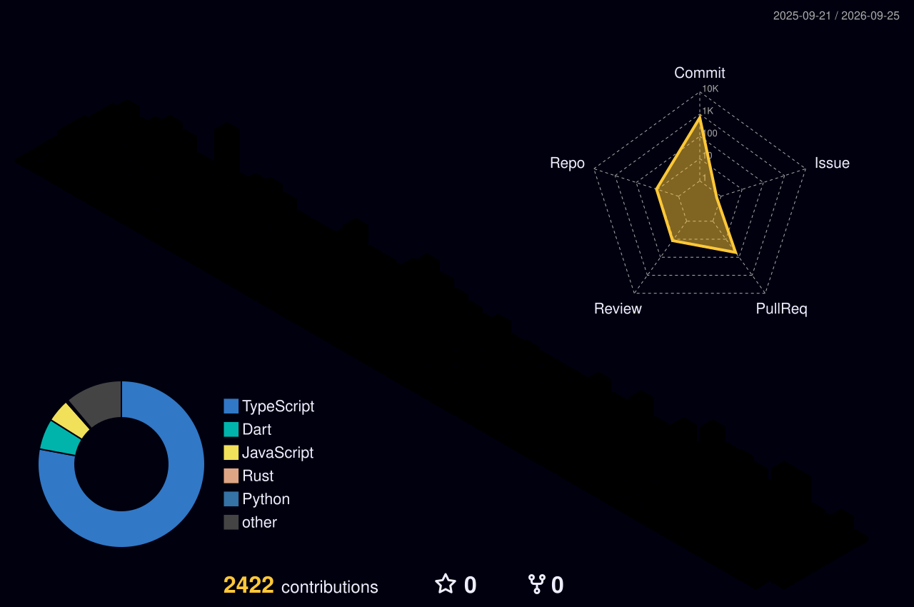

## 🛠️ My Journey

Hello! I'm **Pakkapon Chomchoey** (Tonnam), a **Software Engineer** specializing in **System Architecture** and **Full Stack Development**.

Currently, I'm a fourth-year **Software Engineering** student at **Burapha University** (SE#13). I combine the discipline of a **Track & Field Athlete** with the technical rigor of a **Backend Engineer** to build scalable and reliable systems.

* 🌍 Based in **Chonburi, Thailand**
* 🔭 Working on **High Availability Systems** & **Real-time Applications**
* ✉️ Contact me at [Pakkapon2547@gmail.com](mailto:Pakkapon2547@gmail.com)
* 🧠 Focus: **Backend Engineering, DevOps, Software Engineer**

---

### 💼 **Featured Experience & Projects**

| Role / Project | Key Achievement | Tech Stack |
| :--- | :--- | :--- |
| **Backend Intern @ SAFEALL** | Architected **Bi-directional HA System** (Chaos Tested), Optimized DB (**TimescaleDB/Postgres**) & Built **Real-time Dashboard** (4k+ devices). | `SymmetricDS` `NestJS` `Grafana` `TimescaleDB` `Nginx` `Keepalived` `k6` `Bash` `Redis` |
| **Orbis-Track (Team Lead/Full Stack)** | Designing **Modular Monolith** backend & Real-time approval workflow for enterprise. | `Expressjs` `Docker` `WebSocket` `React` `Redis` |
| **Frontend Intern @ 10BIT** | Developed **Paperless Digital Forms** for healthcare, mirroring legacy UX. | `Vue.js` `Bootstrap` `JavaScript` |
| **MyMap (Team Lead/Full Stack)** | Led a team of 10 to build a **Geospatial Analytics** system in a 1-week sprint. | `Mapbox GL JS` `Laravel` `Livewire` |

---

### 🏆 Awards & Achievements
- 🥇 **Best Full Stack Developer Award (มหาเทพ Full Stack)** – OSSD#13 Bootcamp
  - *Awarded for exceptional performance in End-to-End development (Frontend, Backend, Database).*
- 🎨 **Best UX/UI Design Award** – Cluster 4
- 🏃 **University Athlete** – Competed in the National Inter-University Games (2024 & 2025)

---

### 💻 Tech Stack

**Experience Levels**
| Level | Technologies |
| --- | --- |
| **Basic Programming And Algorithm** |  |
| **Basic Experience** |  |
| **Experienced** |  |

<br/>

**Frequently Used**
| Category | Skills |
| :--- | :--- |
| **Languages** |  |
| **Backend & API** |  |
| **Frontend** |  |
| **Database & ORM** |  |
| **DevOps & Infra** |  |

---

## 📊 Activity & Insights
### ⏱️ Weekly Development Breakdown
<!--START_SECTION:waka-->

```typescript
From: 06 December 2025 - To: 12 August 2026

Total Time: 584 hrs 19 mins

TypeScript                 275 hrs 33 mins       ████████▒░░░░░░░░░░░░░░░░   32.70 %
Other                      258 hrs 16 mins       ███████▓░░░░░░░░░░░░░░░░░   30.65 %
Markdown                   87 hrs 31 mins        ██▓░░░░░░░░░░░░░░░░░░░░░░   10.39 %
JavaScript                 20 hrs 43 mins        ▓░░░░░░░░░░░░░░░░░░░░░░░░   02.46 %
```

<!--END_SECTION:waka-->

<br/>

### 📝 Latest Articles & Writing
<!-- BLOG-POST-LIST:START -->
- [2 วิธี ทำ Login ด้วย Cloudflare Zero Trust &lpar;แชร์ประสบการณ์จาก Side Project&rpar;](https://pakkapon-chomchoey.medium.com/2-%E0%B8%A7%E0%B8%B4%E0%B8%98%E0%B8%B5-%E0%B8%97%E0%B8%B3-login-%E0%B8%94%E0%B9%89%E0%B8%A7%E0%B8%A2-cloudflare-zero-trust-%E0%B9%81%E0%B8%8A%E0%B8%A3%E0%B9%8C%E0%B8%9B%E0%B8%A3%E0%B8%B0%E0%B8%AA%E0%B8%9A%E0%B8%81%E0%B8%B2%E0%B8%A3%E0%B8%93%E0%B9%8C%E0%B8%88%E0%B8%B2%E0%B8%81-side-project-d85b87a291da?source=rss-ab1d870137ac------2)
- [Sociable กับ Solitary unit testing คืออะไร](https://pakkapon-chomchoey.medium.com/sociable-%E0%B8%81%E0%B8%B1%E0%B8%9A-solitary-unit-testing-%E0%B8%84%E0%B8%B7%E0%B8%AD%E0%B8%AD%E0%B8%B0%E0%B9%84%E0%B8%A3-dfca9e2119f9?source=rss-ab1d870137ac------2)
- [LatentMAS คืออะไร?](https://pakkapon-chomchoey.medium.com/latentmas-%E0%B8%84%E0%B8%B7%E0%B8%AD%E0%B8%AD%E0%B8%B0%E0%B9%84%E0%B8%A3-8adeb031c07a?source=rss-ab1d870137ac------2)
- [Forward Proxy vs Reverse Proxy แตกต่างกันอย่างไร](https://pakkapon-chomchoey.medium.com/forward-proxy-vs-reverse-proxy-%E0%B9%81%E0%B8%95%E0%B8%81%E0%B8%95%E0%B9%88%E0%B8%B2%E0%B8%87%E0%B8%81%E0%B8%B1%E0%B8%99%E0%B8%AD%E0%B8%A2%E0%B9%88%E0%B8%B2%E0%B8%87%E0%B9%84%E0%B8%A3-c890fff592a8?source=rss-ab1d870137ac------2)
- [เขียน MongoDB Transaction ใน NestJS ยังไง? ให้ไม่ต้องหยอด { session } ไปทุก Layer](https://pakkapon-chomchoey.medium.com/%E0%B9%80%E0%B8%82%E0%B8%B5%E0%B8%A2%E0%B8%99-mongodb-transaction-%E0%B9%83%E0%B8%99-nestjs-%E0%B8%A2%E0%B8%B1%E0%B8%87%E0%B9%84%E0%B8%87-%E0%B9%83%E0%B8%AB%E0%B9%89%E0%B9%84%E0%B8%A1%E0%B9%88%E0%B8%95%E0%B9%89%E0%B8%AD%E0%B8%87%E0%B8%AB%E0%B8%A2%E0%B8%AD%E0%B8%94-session-%E0%B9%84%E0%B8%9B%E0%B8%97%E0%B8%B8%E0%B8%81-layer-e16ece35afa0?source=rss-ab1d870137ac------2)
<!-- BLOG-POST-LIST:END -->

<br/>

### 🎨 GitHub Contributions



---

### 🌐 Socials

<p align="left"> <a href="https://discord.com/users/pk9113" target="_blank" rel="noreferrer"> <picture> <source media="(prefers-color-scheme: dark)" srcset="https://raw.githubusercontent.com/danielcranney/readme-generator/main/public/icons/socials/discord-dark.svg" /> <source media="(prefers-color-scheme: light)" srcset="https://raw.githubusercontent.com/danielcranney/readme-generator/main/public/icons/socials/discord.svg" />  </picture> </a> <a href="https://www.facebook.com/pakkapon.forb" target="_blank" rel="noreferrer"> <picture> <source media="(prefers-color-scheme: dark)" srcset="https://raw.githubusercontent.com/danielcranney/readme-generator/main/public/icons/socials/facebook-dark.svg" /> <source media="(prefers-color-scheme: light)" srcset="https://raw.githubusercontent.com/danielcranney/readme-generator/main/public/icons/socials/facebook.svg" />  </picture> </a> <a href="http://www.instagram.com/pk_tonnam" target="_blank" rel="noreferrer"> <picture> <source media="(prefers-color-scheme: dark)" srcset="https://raw.githubusercontent.com/danielcranney/readme-generator/main/public/icons/socials/instagram-dark.svg" /> <source media="(prefers-color-scheme: light)" srcset="https://raw.githubusercontent.com/danielcranney/readme-generator/main/public/icons/socials/instagram.svg" />  </picture> </a>
  <a href="https://www.linkedin.com/in/pakkapon-chomchoey-60377b332" target="_blank" rel="noreferrer"> <picture> <source media="(prefers-color-scheme: dark)" srcset="https://raw.githubusercontent.com/danielcranney/readme-generator/main/public/icons/socials/linkedin-dark.svg" /> <source media="(prefers-color-scheme: light)" srcset="https://raw.githubusercontent.com/danielcranney/readme-generator/main/public/icons/socials/linkedin.svg" />  </picture> </a>
</p>
